# K12信息技术编程在线学习平台

> 面向K12师生的信息技术编程在线学习平台，支持学生在线学习、教师课程管理、管理员审核等功能。

## 技术栈

| 层级 | 技术 |
|------|------|
| 后端 | Spring Boot、Shiro、Redis、MyBatis、MySQL |
| 前端 | Vue、Ant Design、Axios |
| 部署 | Maven、Tomcat |

## 功能概览

- **学生端**：课程学习、在线刷题、笔记记录、论坛交流、课程收藏
- **教师端**：课程创建、资源上传、作业考试布置、学生管理
- **管理员端**：用户审核、课程审核、帖子留言审核、公告发布
- **推荐系统**：个性化课程推荐 + 热门帖子推荐

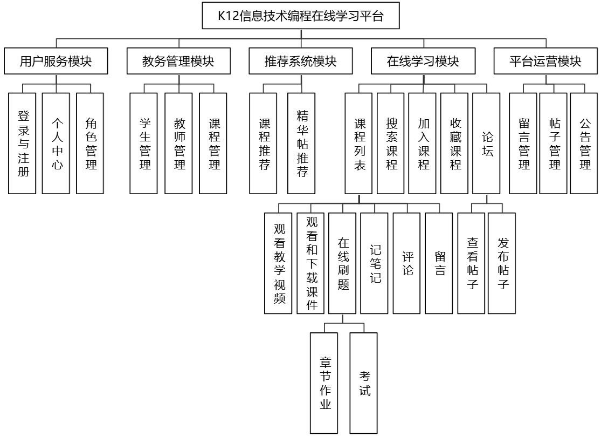

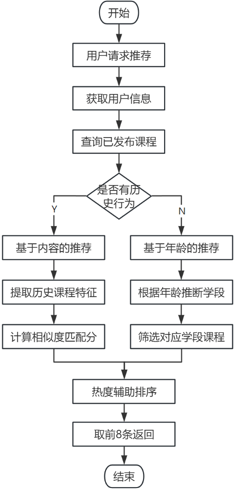

## 项目截图

### 登录注册

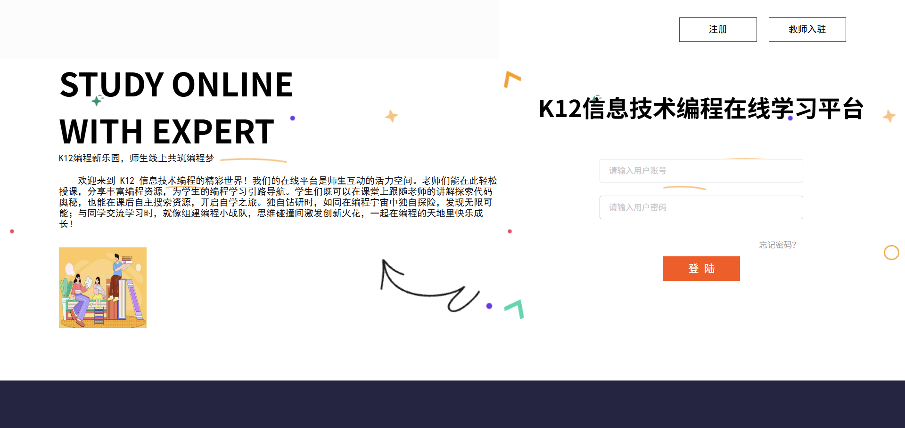

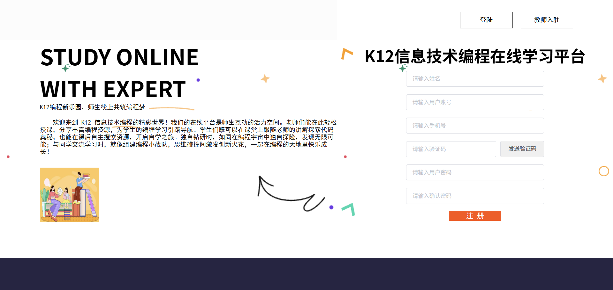

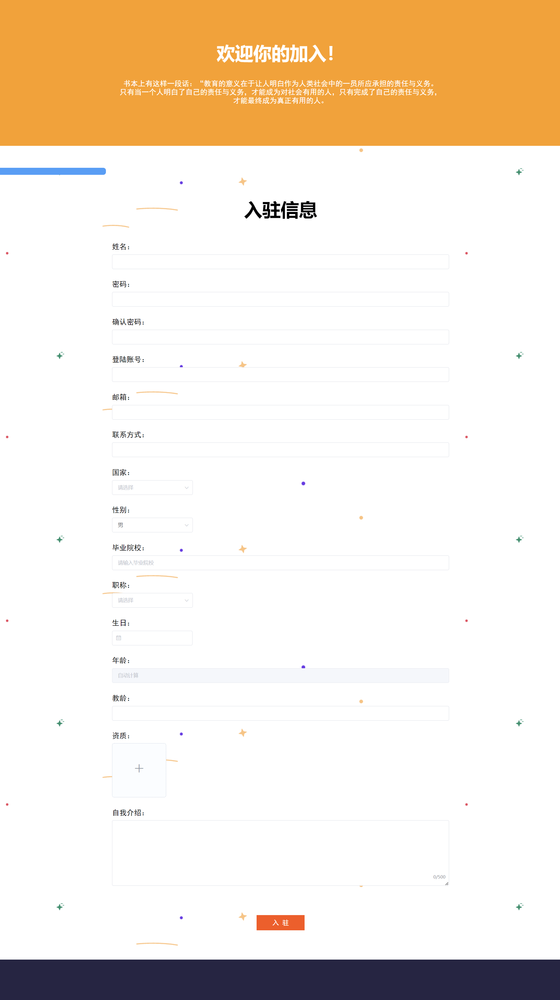

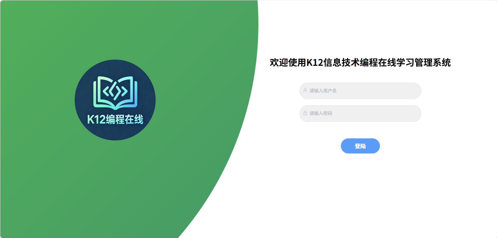

### 学生端首页

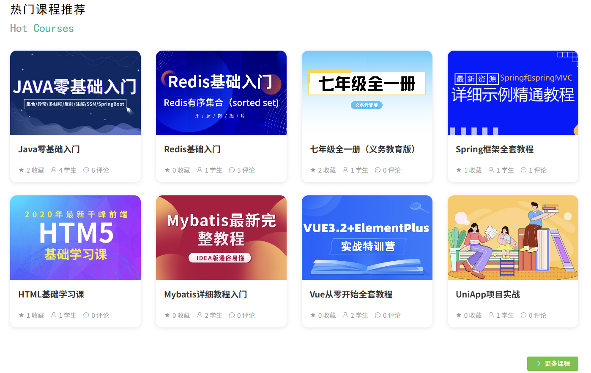

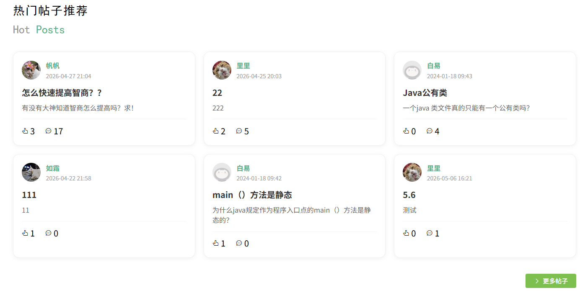

### 课程学习

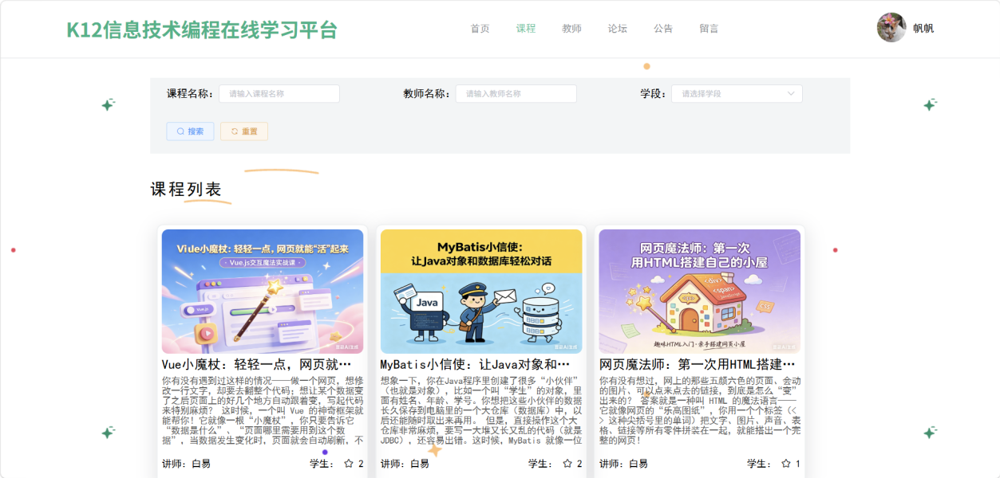

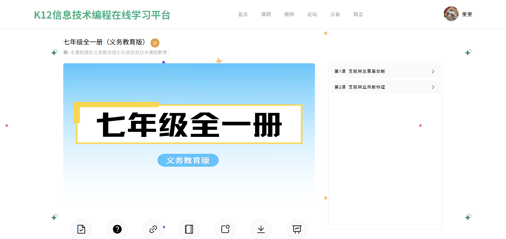

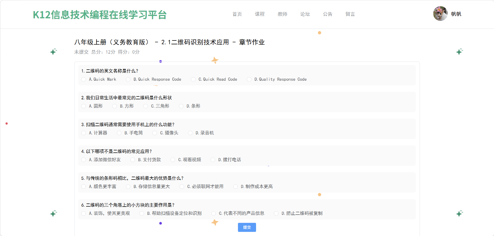

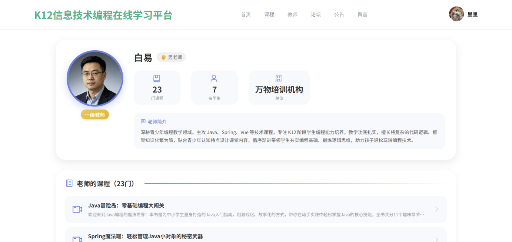

### 论坛交流

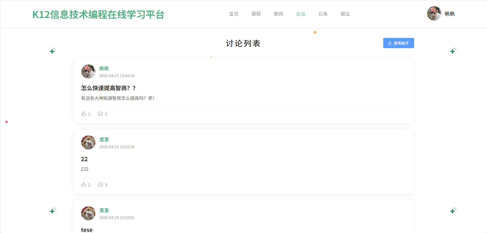

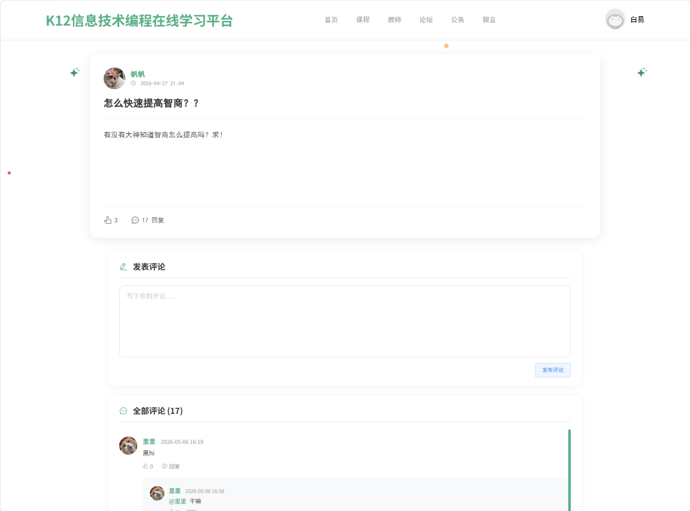

### 个人中心

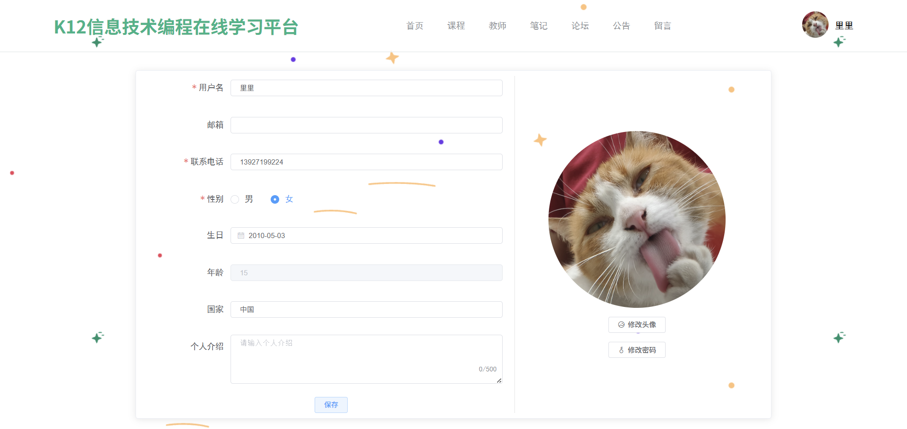

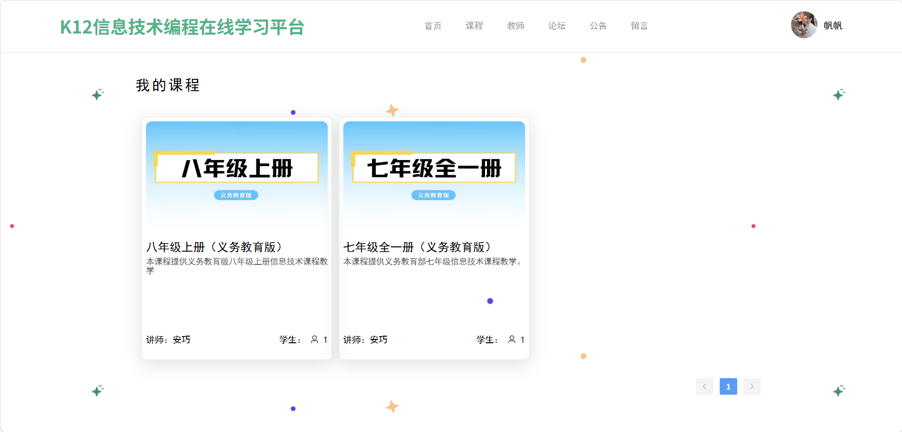

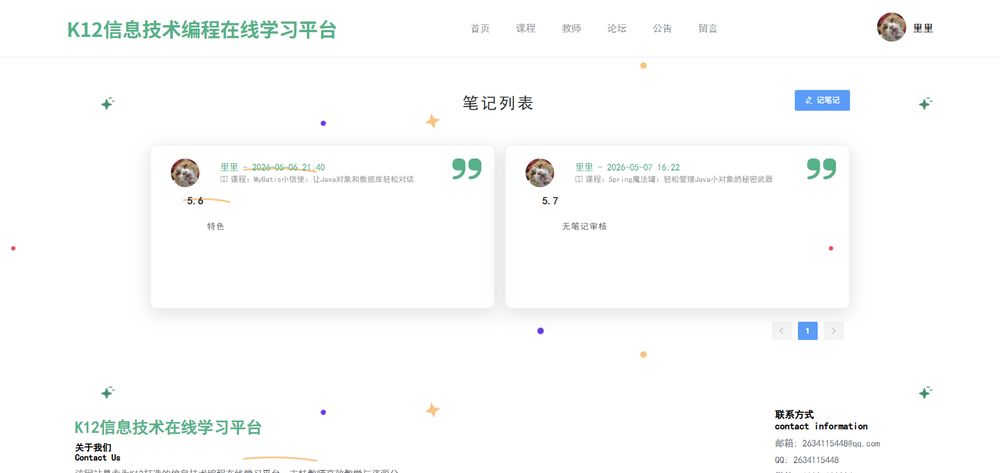

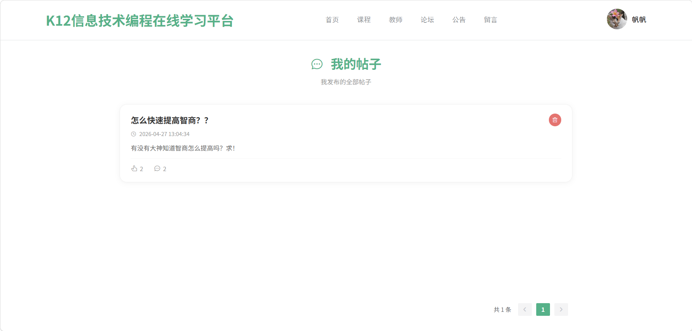

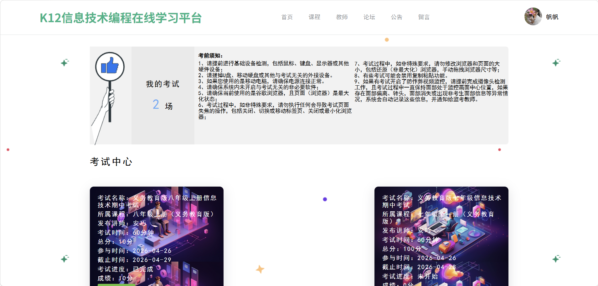

## 运行说明

### 后端启动
1. 导入MySQL数据库
2. 修改 application.yml 中的数据库配置
3. 运行 Spring Boot 主类

### 前端启动
npm run serve
